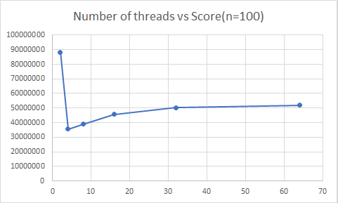
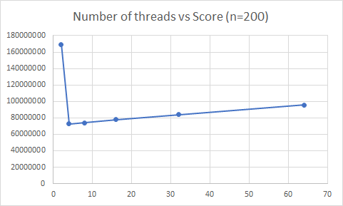

# Group 11 - RuffBandits

## Members

* Marius Jonika (s174411)

* Jack William Marshall Rose (s164559)

* Weston Jones (s191380)

* Sumanth Varambally (s191562)

* Alexandros Spyropoulos (s182346)

* Nicolai Oliver Verbaarschot (s155932)

* Andreas Klit Bundgaard Jensen (s161765)

# Experiments

## Experiment 1: Caching (Weston)

### Motivation / Hypothesis

After testing our program against various client configurations, it appears that the majority of runtime is spent doing “reverse hashing” – hashing sequences of numbers until one of the generated hashes matches the client input. One way to shorten this time, since we know that the final client configuration will be set to repeat hashes, is to store the result of a successful reverse hashing run. This way, when the client repeats itself and sends a hash that our server has seen before, it can immediately send back the correct reverse hash rather than repeating the entire reverse hashing process again.

In this experiment I’ll compare a few methods and data structures for storing and retrieving reverse hashes (I’ll refer to this process as caching from now on). First, as a baseline, I’ll look at performance of the program without any sort of caching. Second, I’ll look at a cache that stores correct reverse hashes in an array and uses a linear search for lookup. Third, I’ll use a cache that operates similarly to a hash table – using a constant mapping values to indices in an array. 

I suspect that caching will provide some sort of performance gain because of the delay argument I explained above and I believe the hash table will function best. Hash tables can do lookup in constant time, which should make cache retrievals and additions very fast. On the other hand, hash tables potentially use up more memory than linear arrays/lists (The hash table should be initialized to a maximum size right away to avoid having to rehash stored values whereas a linear list can easily increase in size later on). Additionally, if the mapping function driving the hash table is inefficient or results in many inputs having the same output, performance can suffer. While these are valid considerations, our hash table doesn’t have to be extraordinarily big and the unique properties of the hashes from the client make writing a good hash function fairly simple. 
 
### Setup / Implementation
	
The implementation of the “baseline” version consisted of the current working version of our server at the time of experimentation (basically the “FIFO” scheduler found under the experiments folder). The other caching methods for this experiment build off this “baseline” as well. 
	
For the linear list, the cache consists of an initially empty array of size 1000 storing key-value pairs and an integer showing the current size of the array. The key-value pairs consist of a key (the hash the server receives from the client) and a value (the reverse hash that the server normally sends back to the client). 

Upon receiving a hash from a client, the server does a linear search of the cache – comparing the received hash against each key in the cache. If a match is found, the value at that index in the cache is treated as the correct reverse hash and sent back to the client. If a match is not found, reverse hashing proceeds as normal and the corresponding key-value pair is added to the end of the list (this is found by referencing and then incrementing the cache size variable). A size of 1000 (the max number of client requests across all configurations), ensures that the array size never exceeds its limit. 

For the hash table cache, the basic structure and operation of the cache is kept the same (the main data structure is an array of size 1000 with each index containing a key-value pair), with a few key differences. First the size variable is removed because it is no longer relevant to this implementation. Second, and more importantly, all cache operations are done in constant time by summing the first four bytes of a hash to compute the index that it belongs in. The maximum value of an unsigned char is 255, so the maximum sum of four is 1020 (An if statement can fix this edge case). 

To effectively compare these caching methods, I used the following custom client: 

* TOTAL=500

* START=1

* DIFFICULTY=10000000

* REP_PROB_PERCENT=20

* DELAY_US=100000

* PRIO_LAMBDA=0

The goal was to provide a substantial challenge to push each implementation to its limits while also allowing each test to be completed quickly so that more holistic results could be obtained and examined.

The custom client used sends 500 requests with a difficulty lowered to 10000000 so that each test finishes in a few minutes. Additionally for importance is assigned to the difficulty of each request rather than the number of requests to assign more importance

Print statements except minor ones common to all implementations are removed to better standardize results. Additionally, since caching affects time more than it does efficient scheduling, the only result I was concerned about was the time the server took to finish processing all the client requests (This was measured with the Unix time command).

These results are displayed below in tabular format.

### Results / Comparison

| Trial | No Cache / Baseline | Arraylist with Linear Search | Hashtable |
|-------|---------------------|------------------------------|-----------|
| 1     | 7m32.484s           | 7m16.300s                    | 5m48.219s |
| 2     | 7m34.122s           | 7m11.293s                    | 5m35.874s |
| 3     | 7m32.372s           | 7m17.450s                    | 5m52.562s |
| 4     | 7m31.428s           | 7m15.359s                    | 5m33.792s |
| 5     | 7m33.465s           | 7m19.773s                    | 5m35.413s |

### Conclusion

The results of this experiment are pretty straightforward and expected.
1. The baseline performed the slowest, as it had to compute fresh hashes every single time.
2. The linear search cache only performed a little bit better because while it adds the benefit of the cache, the additional work of having to search the array in O(n) time counterbalances any gains.
3. The hash table performed the best. Being able to lookup hashes in constant time makes the cache much more efficient and helpful. 

## Experiment: Marius 

## Comparing the speed of multiprocessing and multithreading
The whole point of this experiment was to see by myself, which is truly faster and more efficiently multiple processes or multiple threads (as implemented by other team members). Trying out a different number of processes and comparing it to the results of the test with only threads showed that using threads is more efficient than using several processes since creating a process consumes time and resources. However creating threads definitely more efficient as threads belonging to the same process share the belongings resources of that process. In the end my experiment didn't influence the final speed of our solution.

I've also tried to use processes and threads, but this did not improve the speed of solution, but even made it slower. It's probably because proccesses are more resource hungry than threads and on top of that when creating threads for the multiple processes the threads have to share the processes resources among them.

## Experiment: Alexandros

## Splitting the range of searching the number and assign it to different processes
The purpose of this experiment was to experiment with the splitting of the range of the numbers that our hash function needs to look up to find the number. The hypothesis is that we could 
run in parallel the function that searches for the right number by using different threads. In order to do so we take the range from the request and divide it into K smaller parts. For it's part we create a new thread that will try to solve the problem. When a thread finds the number it returns it to the client and exits. At the same time it sets a global variable so that the rest of the threads can exit without having to finish all the search process and thus gaining time. We run the experiment 3 times for number of threads K=1,2,4 with the below configuration.

### Client parameters:
* Total requests: 100
* Start: Random
* Difficulty: 30000000
* Repetition probability (%): 20
* Request delay (us): 750000
* Priority disabled

### Results
| Number of Threads (K) | Run 1 | Run 2| Run 3| Median Score|
| ------------- | ------------- | -------- | ------| ----|
| 4  | 109827886 |108743485| 115161634 |108743485|
| 2  | 85039204 | 91164865 | 98814641 | 91164865|
| 1  | 89848811 | 98576378 | 106401209 | 98576378 |
 

### Conclusion
From the above table it's clear that our server achieves the best response time for K=2 number of threads. That might be due to the context switch that takes time between the threads. The more the threads the more time is wasted for the context switching. Finally despite having an apparent optimazation with this experiment we didn't use it to the final solution as they were better experiments to include ti to the final solution that achieved more optimization.   

# Experiments (Sumanth) 
## Experiment 1 - Determining the optimum number of threads using a FIFO scheduler
### Motivation:
Every CPU has a fixed number of threads. While we can create as many 'pthreads' as we would like, they are merely a software abstraction and hence, wouldn't run as efficiently as we would like. 

In this case, in the server program, we could simply create a new thread for every request that the server receives. However, this might not be the optimal strategy. It might turn out to be quicker to limit the number of threads and divide the incoming requests only amongst these threads. 

### Configuration setup:
In this experiment, I have built a FIFO scheduler (First In - First Out), using a FIFO queue (built using a linked-list).  First, the number of threads n is fixed. Then, every incoming request is assigned a thread on a first come, first serve basis. Then the score is evaluated for different values of n.

The other configuration parameters is as follows:
* Number of requests: 100 (and) 200
* Priority and repetition disabled
* Seed value: 3435245
* Start = 0
* Difficulty: 30,000,000
* Delay: 750000 us

### Results:
With number of requests = 100:

| Number of Threads | Run 1 | Run 2| Run 3| Median Score|
| ------------- | ------------- | -------- | ------| ----|
| 2  | 87690845 |88261857| 89214609|88261857|
| 4  | 33374446  | 35527196|37329414|35527196|
|8|35663941|38915202|40232184|38915202|
| 16 |  43454399 | 46005546| 45739070|45739070|
|32|  45015038 |50306833|54069237|50306833|
|64| 48387600 | 51996771| 53866891|51996771|
|Unbounded| 44169674|47727583|50377789|47727583|

Plotting this in a graph:

With number of requests = 200:

| Number of Threads | Run 1 | Run 2| Run 3| Median Score|
| ------------- | ------------- | -------- | ------| ----|
| 2  | 169173552|169091237|169262860|169,173,552|
|4| 66722453| 72699030|72717207|72,699,030|
|8| 68185524| 75873876| 73900330|73,900,330|
|16| 72008731|78253152|77969402|77,969,402|
|32|77287483|85856336|84064438|84,064,438|
|64|86746119|95495497|95638747|95,495,497|
|Unbounded|88906194|97414219|97195920|97,195,920|

Plotting this in a graph:

### Conclusions:
From the above experiment, it is clear that choosing n=4 seems to be the optimum choice. As the number of threads exceeds 4, the performance slowly starts degrading. This seems pretty logical since the virtual machine has also been allotted 4 processors.

## Experiment 2 - Using a priority queue for scheduling
### Motivation:
Every request sent from the client has a priority associated with it.  Some requests are more important than others, so they have to be given a higher preference for execution so that the result is returned faster. In this experiment, I try to examine whether using a priority queue can be useful for scheduling tasks to yield a higher score.

### Configuration setup:
Every request has a `priority_score` field, which I have set equal to `priority` for this experiment. I have built a priority queue (array max-heap) to hold and order the requests based on the `priority_score` .  Then the number of threads has been fixed at 4, and a similar approach to scheduling is taken as the previous experiment (top of the priority queue is assigned a new thread whenever it becomes available).

The other configuration parameters is as follows:
* Number of requests: Varied
* Lambda value = 1.5
* Seed value: 3435245
* Start = 0
* Difficulty: 30,000,000
* Delay: 750000 us

### Results
We compare the results for the above configuration with the previous FIFO scheduler:
  

Score for FIFO scheduler:

|Number of requests|Run 1|Run 2|Run 3| Median| 
|------------------|-----|-----|-----|------|
50|15082754|17251782|16149072|16,149,072|
100|30077713|31962473|31579166|31,579,166|
200|76743828|86365248|85838146|85,838,146|

Score for Priority Queue scheduler:

|Number of requests|Run 1|Run 2|Run 3| Median|
|------------------|-----|-----|-----|-------|
50|13631516|14278223|14029912|14,029,912|
100|28805148|29753985|33077179| 28,805,148|
200| 62889042|61192206|60826242| 61,192,206|

### Conclusions
Clearly, using a priority queue to rank the requests based on priority improves the score quite a bit compared to the FIFO approach.

## Experiment 3 - Priority Queue + different criteria

### Motivation:
In the previous experiment, we simply used `priority` as the `priority_score` criteria for the priority queue. However, this does not take the length of the task into account. Note that completing a shorter task first might be more advantageous than a longer one. With this in mind, this experiment slightly modifies the parameters from experiment 2 to test if the hypothesis bears any fruit. 

### Configuration setup:
The same configuration as Experiment 2 is used, with the exception of the `priority_score` being set equal to `priority/length` where `length = end-start`

### Results
We compare the results for the above configuration with the previous experiment:

Score for Priority Scheduler with `priority_score=priority`

|Number of requests|Run 1|Run 2|Run 3| Median|
|------------------|-----|-----|-----|-------|
50|13631516|14278223|14029912|14,029,912|
100|28805148|29753985|33077179| 28,805,148|
200| 62889042|61192206|60826242| 61,192,206|

Score for Priority Scheduler with `priority_score=priority/length`:

|Number of requests|Run 1|Run 2|Run 3| Median|
|------------------|-----|-----|-----|-------|
50|12514493|14686980|13488864|13,488,864|
100|27468806|28737112|29557531|28,737,112|
200|54449134|54446125|62710380|54,449,134|

### Conclusions
Clearly, using `priority/length` as the criteria for prioritising requests seems to work better than simply using`priority`

## Experiment 4: Task Switching
### Motivation:
While the above method works well in prioritising between tasks that have already arrived, the currently running tasks keep running before a new task has been taken on. In this experiment, I try to implement task switching, i.e. switching out a currently running task for a more important one.

### Configuration:
For the client, I again use a similar configuration to Experiments 2 and 3.
However, in the server, the following changes are made:
* Two additional priority queues are maintained, one for paused requests(max-heap) and one for running requests(min-heap).
* Every thousand iterations, the running thread updates its `priority_score` in the `running_requests` queue, based on it's progress.
*  If a more important request is unprocessed, it switches out a low priority task from the `running_requests` queue for the more important task. Meanwhile, the thread running the low priority task is suspended (waiting on a condition), and the paused task is added to the `paused_requests` queue.
* The paused tasks are then resumed when they are the highest priority tasks left.

### Results
I compare the results from Experiment 3 with the current setup:

Score for Priority Scheduler without task switching:

|Number of requests|Run 1|Run 2|Run 3| Median|
|------------------|-----|-----|-----|-------|
50|12514493|14686980|13488864|13,488,864|
100|27468806|28737112|29557531|28,737,112|
200|54449134|54446125|62710380|54,449,134|
400|120468449|122498267|123357713|122,498,267|
600|217826075|231594647|227784506|227,784,506|

Score for Priority Scheduler with task switching:

|Number of requests|Run 1|Run 2|Run 3| Median|
|------------------|-----|-----|-----|-------|
50|13361824|14680197|14633426|14,633,426|
100|28469379|31878181|37527414|31,878,181|
200|66440345|69651739|74331241|69,651,739|
400|144018834|163847950|158393054|158,393,054|
600|321528820|353091996|175797660|321,528,820|

### Conclusions
While the idea, in theory, is appealing, it seems that practically, the overhead of switching tasks (and the associated book-keeping) seems to be too high, especially for lower number of requests. 
Another potential problem is that of paused tasks staying paused for a long time. 

## Experiment 5 - Priority Scheduler with Task switching and aging
### Motivation:
As stated before, the problem of paused tasks staying paused for a long time causes them to score very badly once they are finally processed. Thus, we need to ensure that previously paused requests are processed not too late after they have been paused. This is done through the process of *aging*, where the priority of paused tasks is gradually increased with time. In this experiment, a slight modification to Experiment 4 is tested, where the `priority_score` of a paused request is increased (at once) after pausing.

### Configuration
Same as Experiment 4, except that, before being added to the `paused_requests` queue, the `priority_score` of a (soon-to-be) paused request is increased by a factor of 100, which all but guarantees that it is going to be the next task processed. 

### Results
The results for the above experiment are as follows:
Score for Priority Scheduler with Task switching and aging:

|Number of requests|Run 1|Run 2|Run 3| Median|
|------------------|-----|-----|-----|-------|
50|14079701|14853068|14660201|14,660,201|
100|26643355|31606668|37686529|31,606,668| 
200|62658209|74516205|72941512|72,941,512|
400|160758916|151362085|152202125|152,202,125|
600|190983652|199134136|181146696|190,983,652|

### Conclusion
While the modification has roughly the same score as the previous experiment for lower number of requests, note that as the number of requests increase, the score increases relative to the previous experiment. In fact, it is better than the score of Experiment 3 for a large number of requests.
Hence, for a higher number of requests, it would be prudent to use task switching along with aging.
